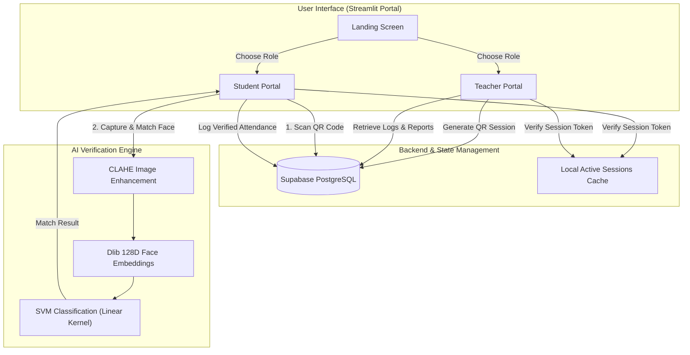
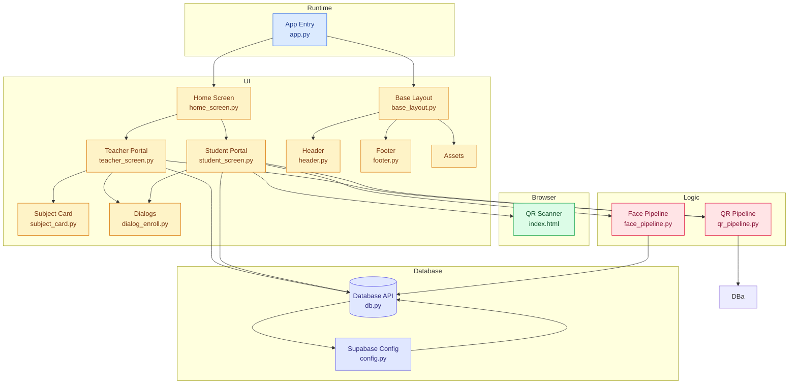

# 📸 SnapClass (v2.0.0)
> **Enterprise-Grade AI-Powered Attendance & Face-Verification Management System**

[](https://www.python.org/)
[](https://streamlit.io/)
[](https://supabase.com/)
[](#)

SnapClass is an intelligent, secure, and modern class attendance management application that integrates **AI-driven Face Recognition** and dynamic **QR Code Verification**. Built specifically for educational institutions, it eliminates manual roll calls and buddy punching, providing a seamless check-in experience for students and robust management tools for teachers.

🚀 **Live Demo:** https://class-web.streamlit.app/

---

## 🏗️ System Architecture

The following flowchart illustrates the high-level architecture and data flow between the user interface portals, the backend database, and the AI processing pipeline.



---

## 🌟 Key Capabilities

### 👨‍🏫 Teacher Portal
*   **Subject & Class Setup:** Register subjects, sections, and custom invite codes.
*   **Live Sessions:** Launch real-time attendance windows with temporary, dynamic QR codes.
*   **Student Registry:** Manage enrolled students and view individual registration metrics.
*   **Reporting Desk:** Filter attendance records by date, subject, or student, with one-click export to CSV.

### 🧑‍🎓 Student Portal
*   **Face Profiling:** Enroll in the AI system by taking 3 reference photos. The system generates high-fidelity embedding vectors and trains a personalized SVM classifier on-the-fly.
*   **Secure QR & Face Login:** Scan teacher-provided QR codes and undergo instant facial verification using the webcam.
*   **Interactive History:** Monitor attendance percentages and status logs per subject.

### 🔒 Enterprise Security Features
*   **Concurrent Session Control:** Active session verifiers compare local session tokens with the database in real-time, preventing users from logging in with a single account across multiple devices.
*   **Zero-Credential Exposure:** Built-in safeguards through a preconfigured `.gitignore` shield database passwords, runtime configurations, local database states, and build cache directories.

---

## 🛠️ Technology Stack

| Layer | Technology | Purpose |
| :--- | :--- | :--- |
| **Frontend UI** | Streamlit | Single-page reactive application framework |
| **Styling** | Vanilla CSS Injections | Custom fonts (Outfit), custom cards, and responsive wrappers |
| **AI / Computer Vision** | Dlib | Frontal face detector & 128-dimensional face embedding extraction |
| **Machine Learning** | Scikit-learn (SVC) | SVM classifier using a linear kernel with balanced class weights |
| **Database & Auth** | Supabase (PostgreSQL) | Dynamic storage of attendance logs, student/teacher details, and session state |
| **QR Code Engine** | Segno | Vector-based dynamic QR Code generator |

---

## 🚀 Installation & Setup Guide

### Prerequisites
- Python 3.9 - 3.11 (Python 3.10 is recommended)
- OS: Windows 10/11, macOS, or Linux
- C++ Compiler Tools (required for building `dlib` from source if precompiled binaries are unavailable)

### 1. Clone the Repository
```bash
git clone https://github.com/Ashish1896/Attendance-ai.git
cd Attendance-ai
```

### 2. Configure Virtual Environment
```bash
# Create the virtual environment
python -m venv venv

# Activate on Windows (cmd/PowerShell)
.\venv\Scripts\activate

# Activate on macOS/Linux
source venv/bin/activate
```

### 3. Install Requirements
```bash
pip install -r requirements.txt
```
*Note: On Windows, `dlib-bin` is listed in `requirements.txt` to streamline installation by pulling precompiled wheels, avoiding compiler setup struggles.*

### 4. Database Credentials Configuration
1. Setup a PostgreSQL project on [Supabase](https://supabase.com/).
2. Create a folder named `.streamlit` at the root directory of the project.
3. Add a file named `secrets.toml` inside `.streamlit/` containing your Supabase project keys:
   ```toml
   [supabase]
   url = "https://your-project-id.supabase.co"
   key = "your-anon-role-key-jwt"
   ```
> [!CAUTION]
> Never commit `.streamlit/secrets.toml` to source control. The `.gitignore` in this project is preconfigured to prevent this.

### 5. Launch the Portal
```bash
streamlit run app.py
```

---

## 📂 Project Directory Structure

```
Attendance-ai/
├── .streamlit/
│   └── secrets.toml          # Supabase access credentials (Git ignored)
├── src/
│   ├── assets/               # Branding graphics, logos, and illustration assets
│   ├── components/           # Reusable UI component modules
│   │   ├── qr_scanner/       # HTML5/JS WebRTC camera stream for QR scanning
│   │   └── dialog_enroll.py  # Portal dialog boxes (Enroll, Add Photo, etc.)
│   ├── database/
│   │   ├── config.py         # Supabase client initializer
│   │   └── db.py             # Database CRUD abstractions and API layer
│   ├── pipelines/
│   │   ├── face_pipeline.py  # Image normalization (CLAHE) & SVM face classification
│   │   └── qr_pipeline.py    # Temporary QR session validator
│   ├── screens/
│   │   ├── home_screen.py    # Application entryway role-selection screen
│   │   ├── teacher_screen.py # Teacher operations dashboard
│   │   └── student_screen.py # Student operations dashboard
│   └── ui/
│       └── base_layout.py    # Styling wrapper and global layout parameters
├── app.py                    # Entry point for the Streamlit server
├── requirements.txt          # Python dependency listing
└── README.md                 # System overview and operational guide
```

---


   # 🏗️ System diagram



---

## 📂 Project Source Files

| Module | File |
|---------|------|
| 🚀 App Entry | [`app.py`](https://github.com/Ashish1896/Attendance-ai/blob/main/app.py) |
| 🏠 Home Screen | [`home_screen.py`](https://github.com/Ashish1896/Attendance-ai/blob/main/src/screens/home_screen.py) |
| 👨‍🏫 Teacher Portal | [`teacher_screen.py`](https://github.com/Ashish1896/Attendance-ai/blob/main/src/screens/teacher_screen.py) |
| 👨‍🎓 Student Portal | [`student_screen.py`](https://github.com/Ashish1896/Attendance-ai/blob/main/src/screens/student_screen.py) |
| 🎨 Base Layout | [`base_layout.py`](https://github.com/Ashish1896/Attendance-ai/blob/main/src/ui/base_layout.py) |
| 📌 Header | [`header.py`](https://github.com/Ashish1896/Attendance-ai/blob/main/src/components/header.py) |
| 📌 Footer | [`footer.py`](https://github.com/Ashish1896/Attendance-ai/blob/main/src/components/footer.py) |
| 📚 Subject Card | [`subject_card.py`](https://github.com/Ashish1896/Attendance-ai/blob/main/src/components/subject_card.py) |
| 💬 Enrollment Dialog | [`dialog_enroll.py`](https://github.com/Ashish1896/Attendance-ai/blob/main/src/components/dialog_enroll.py) |
| 📷 QR Scanner | [`index.html`](https://github.com/Ashish1896/Attendance-ai/blob/main/src/components/qr_scanner/index.html) |
| 🤖 Face Recognition | [`face_pipeline.py`](https://github.com/Ashish1896/Attendance-ai/blob/main/src/pipelines/face_pipeline.py) |
| 🔐 QR Validation | [`qr_pipeline.py`](https://github.com/Ashish1896/Attendance-ai/blob/main/src/pipelines/qr_pipeline.py) |
| 🗄️ Database API | [`db.py`](https://github.com/Ashish1896/Attendance-ai/blob/main/src/database/db.py) |
| ⚙️ Supabase Config | [`config.py`](https://github.com/Ashish1896/Attendance-ai/blob/main/src/database/config.py) |


## 🤖 Deep Dive: AI Face Matching Pipelines
SnapClass achieves high-accuracy facial verification by applying standard pre-processing:
1. **Contrast Equalization:** Adapts to variable classroom lighting using Contrast Limited Adaptive Histogram Equalization (**CLAHE**) on the grayscale representation of input frames.
2. **Feature Extraction:** Leverages Dlib's shape predictor to find facial landmarks, feeding them to the ResNet-based face descriptor model to output a unique 128-dimensional embedding.
3. **SVM Classification:** Trains a Support Vector Machine with a linear boundary using all enrolled student embeddings. During attendance validation, the model outputs match probabilities. Check-ins are approved only if the match probability exceeds safety thresholds.

## 🏗️ System Summery

The architecture of **SnapClass (Attendance-ai)** follows a layered design that separates the user interface, application logic, AI pipelines, and data access layer.

- 🌐 **Browser Layer** – Student and Teacher interact through the Streamlit web interface.
- 🖥️ **Application Layer** – Streamlit manages authentication, navigation, dashboards, and attendance workflows.
- 🤖 **AI Processing Layer**
  - **Face Recognition Pipeline:** Image preprocessing (CLAHE) → Face Detection (dlib) → 128-D Face Embeddings → SVM Classification.
  - **QR Verification Pipeline:** Generates and validates secure 6-character QR codes for attendance sessions.
- 🗄️ **Data Access Layer** – Handles all CRUD operations through a centralized database API.
- ☁️ **Persistence Layer**
  - **Supabase (PostgreSQL):** Stores students, teachers, subjects, attendance records, and face embeddings.
  - **Local JSON Storage:** Maintains temporary QR sessions and application state.

The layered architecture improves modularity, maintainability, and scalability by separating presentation, business logic, AI processing, and data management.
